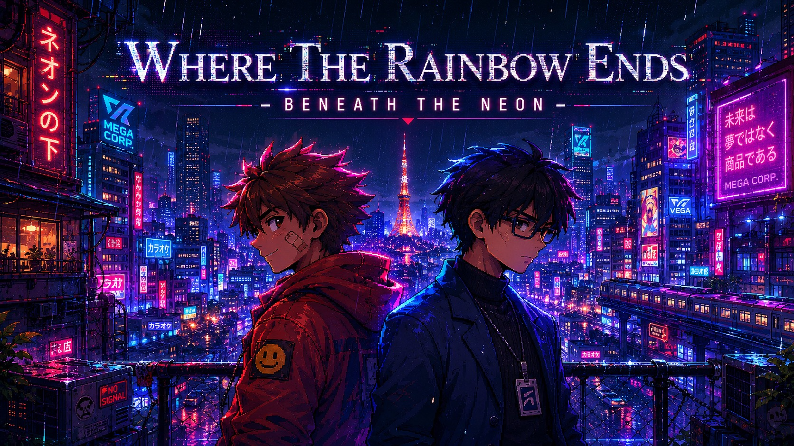

  

# Where the Rainbow Ends

  <em>A cyberpunk visual novel about two people trapped by the same city in different ways.</em>

  
  
  
  

---

## Demo

https://github.com/user-attachments/assets/9502e37b-4f47-4382-a887-8f97f52ae58a

## About

Tokyo hums with efficiency. Its towers gleam, its transit runs on time, its citizens smile in corporate headshots. But beneath the neon, something is unraveling.

**Where the Rainbow Ends** follows **Morikawa Reiji**, a mid-level engineer at a systems corporation, as a chance encounter with **Ren** — a drifter from the lower wards — pulls him into corners of the city he was never meant to see. Through a branching narrative, players navigate conversations where what's said aloud and what's thought in silence are equally important.

## Features

- **Split-screen dialogue system** — See both what characters say and what they truly think, side by side
- **Branching narrative** — Choices shape dialogue tone, trust between characters, Reiji's internal monologue, and which ending you reach
- **Original cyberpunk setting** — A futuristic Tokyo that looks prosperous on the surface but hides surveillance, inequality, and emotional exhaustion underneath
- **High-resolution art** — 1920×1080 with hand-crafted backgrounds and character portraits

## How to Play

1. Download and install the application [Ren'Py](https://drive.google.com/drive/folders/1sgDBV73fYzE96zzLbnizfG47LgLW-w_s?usp=sharing)
2. Unzip and run. Enjoy!

## Characters

| Character | Role |
|-----------|------|
| **Morikawa Reiji** | A corporate engineer who has spent years keeping his head down. Stable job, clean apartment, quiet unease. |
| **Ren** | A drifter from the lower wards. Sharp, unpredictable, and carrying knowledge of the city that Reiji's maps don't show. |

## Credits

Built with [Ren'Py](https://www.renpy.org/). All art, writing, and audio are original.

---

  <em>Hackathon 2026</em>

